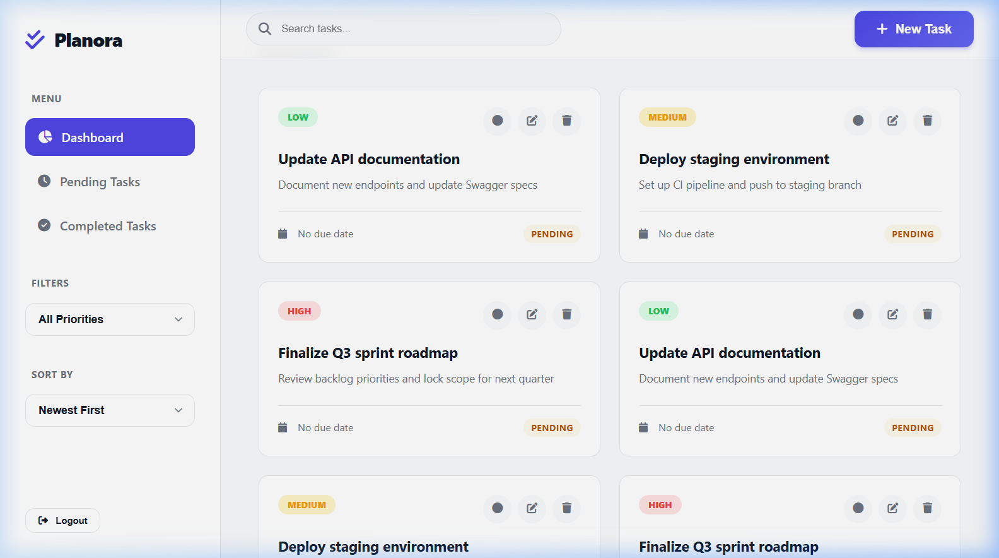
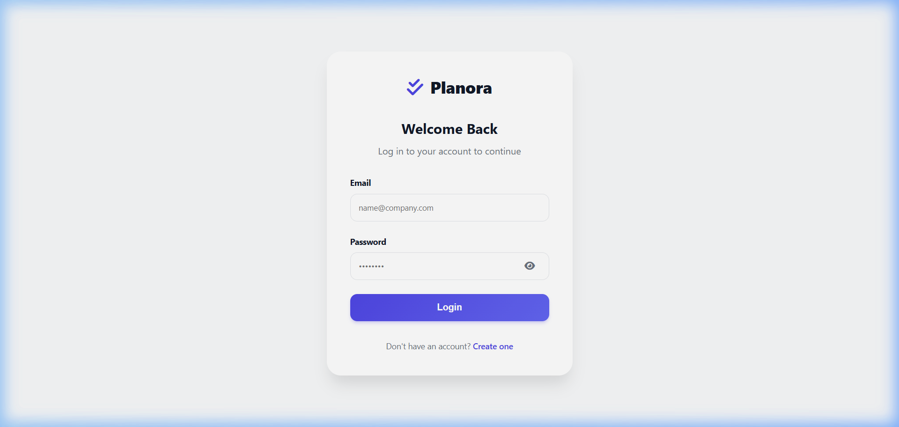
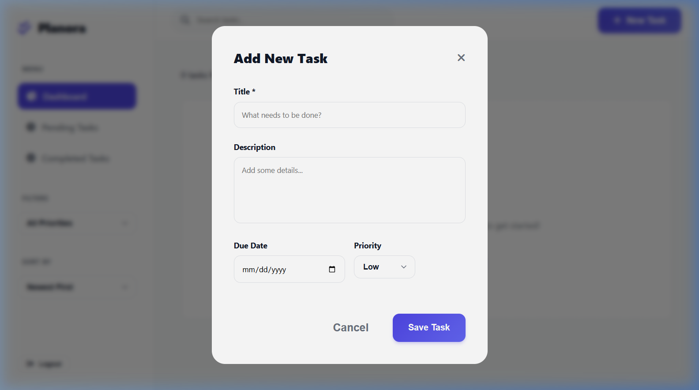

<div align="center">


<br/>

<a href="#">
  
</a>

<br/>


</div>

---

## Product Overview

Planora is a full-stack task management system engineered for speed and reliability. It is not a to-do list — it is a structured workflow tool where every interaction is instant, every mutation is optimistic, and the UI never waits for the server.

**The core philosophy:** fetch all data once, then operate entirely client-side. Filtering, sorting, searching, and pagination happen in-memory with zero additional API calls. Server mutations (create, update, delete) render immediately through optimistic updates, with automatic rollback on failure.

**Built for:** individuals and small teams who need a fast, self-hosted task system without the overhead of enterprise platforms like Jira or Asana.

---

## Key Features

**Optimistic CRUD operations** — Every create, update, and delete reflects in the UI instantly. The client writes to local state first, renders the change, then reconciles with the server asynchronously. If the API call fails, the mutation is reverted and the user is notified. No spinners, no blocking.

**Client-side filter engine** — On page load, the full task set is fetched once and cached in memory. All subsequent filtering (status, priority), searching (title + description), and sorting (date, priority, alphabetical) operate against this local cache. Result: sub-millisecond filter response times.

**Local pagination** — Tasks are paginated client-side with a configurable page size (default: 6). The pagination component renders dynamically with ellipsis compression for large page counts. No server round-trips on page change.

**Surgical DOM updates** — Toggling task completion does not re-render the entire list. The `applyCardState` function patches only the affected card's classes, icons, and text — avoiding unnecessary reflows.

**Soft delete** — Tasks are never permanently removed from the database on the first pass. The `isDeleted` flag allows for future recovery features without data loss.

**JWT authentication** — Stateless token-based auth with `bcryptjs` password hashing (10-round salt). Tokens are issued on login/register and validated via a `protect` middleware wrapper on every API handler.

**Responsive sidebar layout** — Collapsible sidebar with overlay for mobile viewports (≤1024px). Desktop shows the sidebar persistently; mobile uses a slide-in panel with backdrop dismiss.

---

## Live Demo

<div align="center">



<br/><br/>

| Authentication | Task Creation |
|:---:|:---:|
|  |  |

</div>

---

## System Architecture

```
┌─────────────────────────────────────────────────────────────┐
│                        CLIENT (SPA)                         │
│                                                             │
│   index.html ─── script.js ─── utils.js ─── style.css      │
│   login.html ──┐                                            │
│   signup.html ─┤── auth.js ── auth.css                      │
│                                                             │
│   ┌───────────────────────────────────────────────────┐     │
│   │         In-Memory Task Cache (allTasks[])         │     │
│   │   filter / sort / search / paginate — no API      │     │
│   └───────────────────────────────────────────────────┘     │
└──────────────────────┬──────────────────────────────────────┘
                       │  REST (JSON)
                       │  Authorization: Bearer <JWT>
┌──────────────────────▼──────────────────────────────────────┐
│                     EXPRESS SERVER                           │
│                                                             │
│   server.js (entry)                                         │
│   ├── POST /api/auth/login     → api/auth/login.js          │
│   ├── POST /api/auth/register  → api/auth/register.js       │
│   ├── GET  /api/tasks          → api/tasks/index.js         │
│   ├── POST /api/tasks          → api/tasks/index.js         │
│   └── ALL  /api/tasks/:id      → api/tasks/[id].js          │
│                                                             │
│   Middleware: protect() — JWT verify → User lookup           │
│   Error handling: centralized try/catch wrapper              │
└──────────────────────┬──────────────────────────────────────┘
                       │  Mongoose ODM
┌──────────────────────▼──────────────────────────────────────┐
│                   MONGODB ATLAS                              │
│                                                             │
│   Collections:                                              │
│   ├── users  { name, email, password(hashed), createdAt }   │
│   └── tasks  { user(ref), title, description, dueDate,      │
│                priority, completed, isDeleted, createdAt }   │
│                                                             │
│   Connection: cached singleton (global.mongoose)             │
└─────────────────────────────────────────────────────────────┘
```

**Data flow on task creation (optimistic):**

```
User submits form
  → Modal closes immediately
  → Temp task inserted into allTasks[] with __temp__ ID
  → UI re-renders with new card (slide-in animation)
  → POST /api/tasks fires in background
  → On success: temp entry swapped with server document
  → On failure: temp entry removed, UI re-renders, error toast shown
```

---

## Performance & Optimization

| Technique | Implementation | Impact |
|-----------|---------------|--------|
| **Single-fetch architecture** | All tasks loaded once via `GET /api/tasks?limit=1000` on page load | Eliminates repeated API calls during filtering, sorting, and pagination |
| **Client-side filtering** | `applyFiltersAndRender()` chains status → priority → search → sort → paginate on the cached `allTasks[]` array | Sub-millisecond filter latency regardless of server response time |
| **Optimistic mutations** | Create/update/delete modify local state and render before the API responds | UI feels instant; server latency becomes invisible to the user |
| **Surgical DOM patching** | `toggleComplete()` calls `applyCardState()` which updates only the specific card's class, icon, and text nodes | Avoids full list re-render on status toggle |
| **Debounced search** | Search input uses a 200ms debounce before triggering `applyFiltersAndRender()` | Prevents excessive re-renders during rapid typing |
| **Connection pooling** | `connectDB()` caches the Mongoose connection on `global.mongoose` | Avoids reconnecting to MongoDB on every request (critical for serverless) |
| **Graceful degradation** | Failed fetches fall back to cached data with a warning toast | UI remains functional even during temporary network issues |

---

## Tech Stack

| Layer | Technology | Role |
|-------|-----------|------|
| **Frontend** | Vanilla JS, HTML5, CSS3 | SPA with no build step — ships raw to the browser |
| **Backend** | Node.js, Express 4.18 | REST API with handler-based routing |
| **Database** | MongoDB Atlas (Mongoose 8.1) | Document store with schema validation |
| **Auth** | JWT (`jsonwebtoken`), `bcryptjs` | Stateless authentication, salted password hashing |
| **Deployment** | Vercel (serverless) + local Express fallback | Production deployment with zero-config CI |
| **Icons** | Font Awesome 6.4 | UI iconography |

---

## Security

- **Password storage** — Passwords are hashed with `bcryptjs` using a 10-round salt. Raw passwords are never stored or logged. The `password` field is excluded from queries by default (`select: false`).
- **Token-based auth** — JWTs are issued on login/register and required for all `/api/tasks` endpoints. The `protect()` middleware extracts the token from the `Authorization: Bearer` header, verifies it against `JWT_SECRET`, and attaches the resolved user to `req.user`.
- **Ownership isolation** — Every task query is scoped to `{ user: req.user._id }`. Users cannot read, modify, or delete tasks belonging to other accounts.
- **Input validation** — Mongoose schema enforces required fields, max lengths (title: 200 chars), enum constraints (priority: `low | medium | high`), and email format via regex. Malformed requests return 400 with a descriptive message.
- **XSS prevention** — All user-generated content (title, description) is escaped via `escapeHtml()` before DOM insertion.
- **Auto-logout** — 401 responses from the API automatically clear `localStorage` and redirect to the login page.

---

## Installation

**Prerequisites:** Node.js 18+, a MongoDB Atlas cluster (or local MongoDB instance).

```bash
# 1. Clone
git clone https://github.com/KandhalShakil/Planora-Production-Grade-Task-Management.git
cd Planora-Production-Grade-Task-Management

# 2. Install dependencies
npm install

# 3. Configure environment
#    Create a .env file in the project root:
echo "MONGO_URI=your_mongodb_connection_string" > .env
echo "JWT_SECRET=your_secret_key" >> .env

# 4. Start the server
npm start
```

The app will be available at `http://localhost:3000`.

**Vercel deployment:**

The project includes a `vercel.json` with pre-configured routing. Push to a GitHub repo connected to Vercel — API routes and static frontend will deploy automatically.

---

## Project Structure

```
├── server.js                 # Express entry point, route registration
├── vercel.json               # Vercel serverless routing config
├── package.json
├── .env                      # MONGO_URI, JWT_SECRET
│
├── api/
│   ├── auth/
│   │   ├── login.js          # POST /api/auth/login
│   │   └── register.js       # POST /api/auth/register
│   ├── tasks/
│   │   ├── index.js          # GET/POST /api/tasks
│   │   └── [id].js           # GET/PUT/DELETE /api/tasks/:id
│   ├── config/
│   │   └── db.js             # Mongoose connection (cached singleton)
│   ├── models/
│   │   ├── User.js           # User schema + password hashing hooks
│   │   └── Task.js           # Task schema with soft-delete flag
│   └── utils/
│       ├── auth.js           # protect() middleware wrapper
│       └── token.js          # JWT generation helper
│
└── frontend/
    ├── index.html            # Dashboard SPA
    ├── login.html            # Login page
    ├── signup.html           # Registration page
    ├── script.js             # Core app logic (CRUD, filters, pagination)
    ├── auth.js               # Login/register form handling
    ├── utils.js              # Popup, confirm dialog, debounce
    ├── style.css             # Full application styles
    └── auth.css              # Auth page styles
```

---

## API Reference

| Method | Endpoint | Auth | Description |
|--------|----------|------|-------------|
| `POST` | `/api/auth/register` | No | Create account. Body: `{ name, email, password }` |
| `POST` | `/api/auth/login` | No | Authenticate. Body: `{ email, password }` → Returns JWT |
| `GET` | `/api/tasks` | Bearer | List all tasks for authenticated user |
| `POST` | `/api/tasks` | Bearer | Create task. Body: `{ title, description?, dueDate?, priority? }` |
| `GET` | `/api/tasks/:id` | Bearer | Get single task by ID |
| `PUT` | `/api/tasks/:id` | Bearer | Update task fields |
| `DELETE` | `/api/tasks/:id` | Bearer | Soft-delete task (`isDeleted: true`) |

All responses follow the shape `{ success: boolean, data?: object, message?: string }`.

---

## Roadmap

- [ ] WebSocket layer for multi-client real-time sync
- [ ] Role-based access control (workspace owner, member, viewer)
- [ ] Email notifications for approaching deadlines
- [ ] Drag-and-drop task reordering with persisted sort order
- [ ] Dark/light theme toggle with CSS variable system
- [ ] Task labels and tag-based grouping
- [ ] Mobile-native companion (React Native)

---

## Author

**Kandhal Shakil** — [GitHub](https://github.com/KandhalShakil) · [LinkedIn](https://linkedin.com/in/kandhalshakil)

---

## License

Released under the [MIT License](LICENSE). Copyright © 2026 Kandhal Shakil.

<div align="center">

</div>
